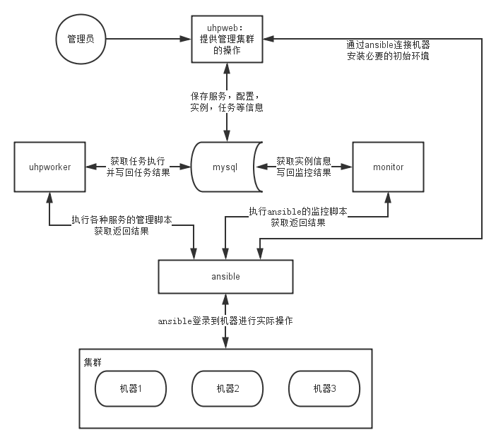

1. 技术选型（已评估）
    - 主要开发语言python
    - 使用ansible作为底层自动化运维的工具
    - web层使用Tornado作为Web Server开发REST API
    - 管理控制台： Tornado + SQLAlchemy0.7.99 + Angularjs 
	- worker层： python + threadpool + ansible
	- monitor层： python + ansible + shell
    - 第三软件： snakemq、Mysql
2. 系统架构、边界
    
3. 各组件的交互
	- web部分面向管理者提供一站式的服务管理，将向mysql提交要执行的任务
	- worker定期检查mysql的任务表，获取任务执行并将结果写回mysql
	- monitor从mysql中获取实例列表，并监控对应的实例，将监控结果写回mysql
	- mysql做线上热备
	- worker和web通过ansible进行实际的机器操作